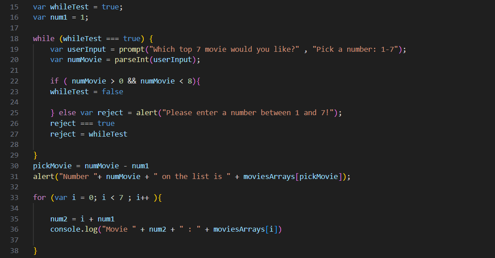

# http5122-Front-End
Class content from Front-End Web Development


***HTTP5122 - Front-End Web Development*** is a class primarily focuses on learning to code in JavaScript.

[JavaScript-w3s](https://www.w3schools.com/js/)

>Week3 Loop e.g.



>Week 4 Fuction e.g.

```javascript
function averageOfNumbers(num1, num2, num3, num4, num5){
    var sum = num1+num2+num3+num4+num5;
    return ((sum/5).toFixed(1));
}
var avg= averageOfNumbers(5, 10, 15, 20, 25);
```